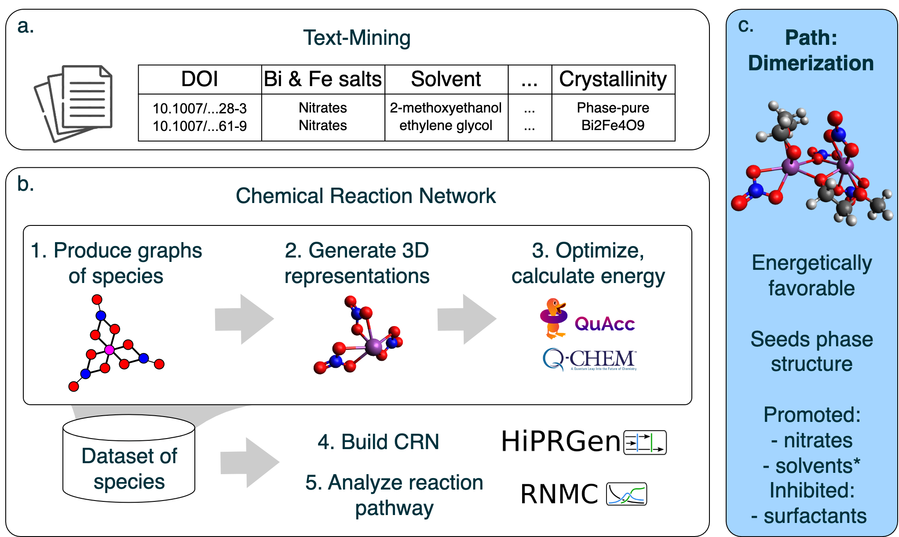

# Precursor Reaction Pathway Leading to BiFeO₃ Formation: Insights from Text-Mining and Chemical Reaction Network Analyses

This repository builds a dataset for Chemical Reaction Network (CRN) analysis and text-mined data analysis for synthesis route studies.

Please refer to our ChemRxiv preprint:  
**Precursor Reaction Pathway Leading to BiFeO₃ Formation: Insights from Text-Mining and Chemical Reaction Network Analyses**  
V. Baibakova, K. Cruse, M. G. Taylor, C. M. Sutter-Fella, G. Ceder, A. Jain, and S. Blau (2025)



---

## Table of Contents
1. [Text-mining](#text-mining)
2. [CRN graphs](#crn-graphs)
3. [CRN 3D](#crn-3d)
4. [Calculations](#calculations)
5. [Citation](#citation)

---

## Text-mining

The text-mining analysis of synthesis recipes, as outlined in the paper, can be found in the `CRN_Text_mining` directory. The synthesis recipe dataset is located at `CRN_Text_mining/bfo_lit_df_master_20240125.csv`. You can also explore the Jupyter notebook for data analysis and visualization in `CRN_Text_mining/CRN_Text_Mining.ipynb`.

---

## CRN graphs

To populate the species dataset for the CRN, we focused on Bi–O bond patterns and first generated the reaction intermediates as molecular graphs. Data files associated with the CRN generation of intermediate graphs can be found in `CRN_Molassembler_frag_recomb`. The set of molecular graphs is located in `CRN_Molassembler_frag_recomb/filtered_3_log_upd.txt`.

### 1. Install [SCINE Molassembler](https://scine.ethz.ch/download/molassembler) for Python.

### 2. Navigate to the `CRN_Molassembler_frag_recomb` directory and explore its contents. This directory contains XYZ files of the initial structures required to build the set of intermediate species, including:
- Initial complex Bi(NO₃)₃: `bino3.xyz`
- Solvent 2-methoxyethanol: `moe.xyz`, `moe_ion.xyz`
- Nitrite and nitric acid ligands: `no3.xyz`, `hno3.xyz`
- Water: `h2o.xyz`

### 3. To generate a set of molecular graph species for the given molecular space, run the Python script:
```bash
python CRN_Molassembler_frag_recomb/molassembler_frag_recomb.py
```
*(Ensure that you update the directory variable as needed.)*  
*Note: This process may take a while, so you might want to submit the job to a remote cluster node (see our example in `batch.sub`).*

### 4. The script will generate the following output files:
- `stat.txt`: Contains the number of graphs generated at each step.
- `log.json`: Provides a reduced description of the complexes used as input for Architector.
- `recombinants.json`: Contains the full description of the complexes generated by Molassembler.

We will focus on `log.json`.

### 5. To reduce the computational load, you can filter the generated graphs using `filter_log.py` and `filt_3_lig.py`:
- Running `filter_log.py` removes complexes with solvent attached only via the methoxy oxygen and generates `filtered_log.json`.
- Running `filt_3_lig.py` removes complexes with four or more nitrite ligands (nitrite ion and nitric acid) or four or more solvent ligands, and generates `filtered_3_log.json`.

You can also conveniently explore the filtered file in TXT format.

---

## CRN 3D

To complete the generation of intermediate species for the CRN dataset, we built 3D conformers from the latent molecular graph representations created in the previous step. Data files associated with the CRN generation of 3D conformers (using [Architector](https://github.com/lanl/Architector) on a remote cluster) can be found in the `CRN_Architector` directory.

### 1. On a remote cluster, install Miniconda (if you haven't already):
```bash
wget https://repo.anaconda.com/miniconda/Miniconda3-latest-Linux-x86_64.sh
bash Miniconda3-latest-Linux-x86_64.sh
# Follow the prompts:
# - Accept the license terms
# - Accept the default installation location
# - Confirm running conda init (answer "yes")
source ~/.bashrc
conda update conda
# When prompted, proceed by typing "y"
```
Ensure that the file `~/miniconda3/etc/profile.d/conda.sh` exists.

### 2. Create a conda environment using the script provided in `CRN_Architector/set_arch.sh`. You can either use it as a reference or make it executable and run it from the terminal:
```bash
chmod +x CRN_Architector/set_arch.sh
./CRN_Architector/set_arch.sh
```

### 3. Explore the script that runs Architector: `CRN_Architector/build_structures_arch.py`.  
This script:
- Lists the SMILES strings of all ligands.
- Uses the set of molecular graphs generated in the previous step as input.
- Runs Architector with force-field pre-optimization, sets the solvent to "octanol", and requests 20 total metal-center symmetries.
- Utilizes the Sella optimizer and performs geometry relaxation with GFN2-xTB.  
Running `CRN_Architector/build_structures_arch.py` produces XYZ files for the 3D conformers.

### 4. Execution of this script on a single complex graph can take between 1 to 10 CPU node-hours. To save time, we parallelized the script execution by submitting each graph as a separate job. See the files `batch.sub` and `submit_calc.sh` for reference.

---

## Calculations

To obtain Gibbs free energies for species in the dataset, we followed an optimization-frequency-single point (opt-freq-sp) calculation workflow. Data files for the high-throughput calculations with pipeline automation using [QuAcc](https://quantum-accelerators.github.io/quacc/index.html) can be found in `CRN_Quacc`.

### 1. Create a conda environment using the script in `CRN_Quacc/set_newquacc.sh`. You can either use it as a reference or make it executable and run it from the terminal:
```bash
chmod +x CRN_Quacc/set_newquacc.sh
./CRN_Quacc/set_newquacc.sh
```

### 2. The calculation workflow setup (with the parameters we used) is provided in `CRN_Quacc/build_test.py`.  
This workflow:
- Performs geometry relaxation with QChem.
- Carries out frequency calculations with TBLite.
- Applies a single point correction in QChem.
  
Calculation results are stored in MongoDB; please use your preferred method of result retrieval to calculate the final Gibbs free energies.

---

## Citation

If you find these examples useful, please consider citing our ChemRxiv preprint:

**Precursor Reaction Pathway Leading to BiFeO₃ Formation: Insights from Text-Mining and Chemical Reaction Network Analyses**  
V. Baibakova, K. Cruse, M. G. Taylor, C. M. Sutter-Fella, G. Ceder, A. Jain, and S. Blau (2025)
